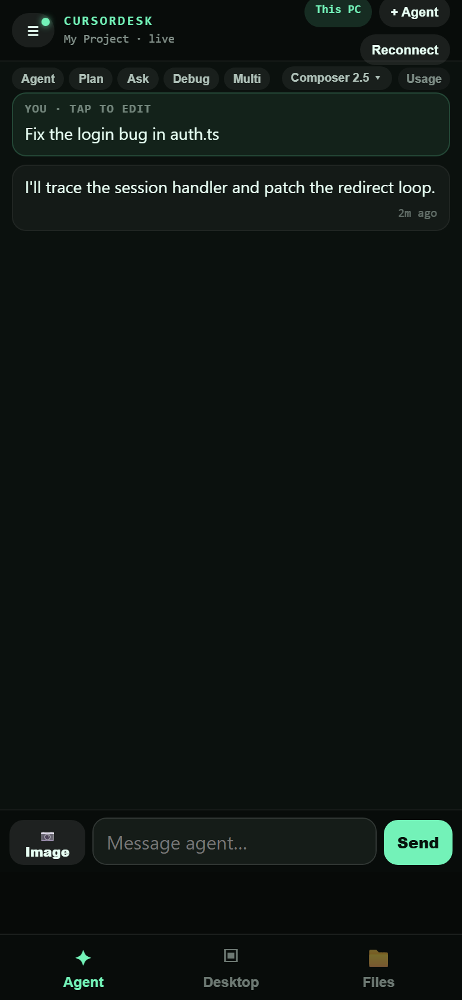
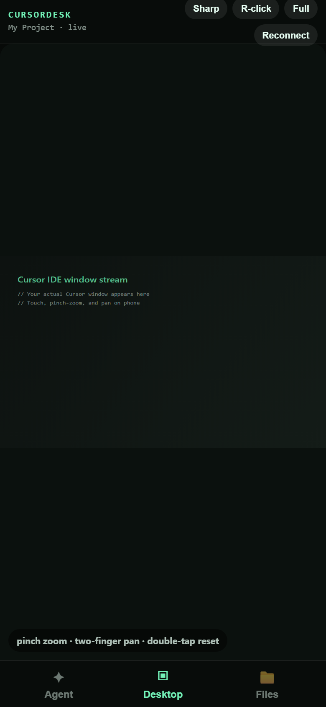
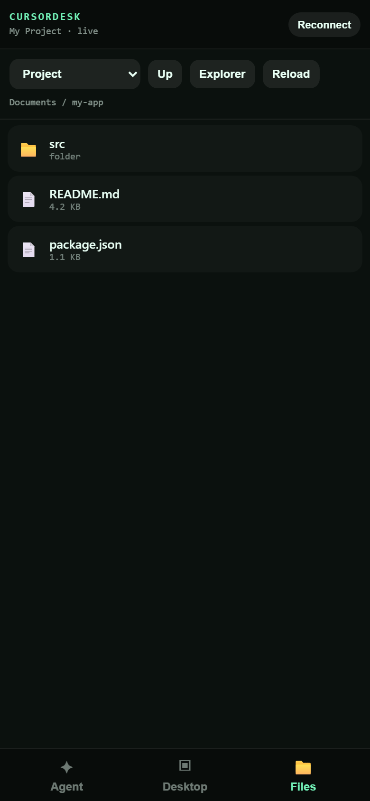

# CursorDesk

**Use Cursor from your phone** — chat with agents, approve tool runs, stream the desktop, and browse files on your PC over a private Tailscale connection.

No cloud relay for your code. The host runs on your Windows machine; your phone talks to it through Tailscale. MCP servers and local tools stay on the PC.

Screenshots below are **captured from the real phone web UI** (sample chat/file names only — not a mockup). Refresh them anytime with `Host\capture_screenshots.py` while the host is running.



---

## What you get

| Tab | What it does |
|-----|----------------|
| **Agent** | Chat, switch conversations, approve/reject tool calls, attach images, change model/mode — via Cursor's CDP bridge |
| **Desktop** | Low-latency stream of the Cursor window with touch, pinch-zoom, pan, and right-click |
| **Files** | Browse folders on the PC, preview images/text, open in Explorer |





---

## Requirements

| Component | Notes |
|-----------|--------|
| **Windows 10/11** | Host only runs on Windows (uses Win32 capture + input) |
| **Python 3.9+** | [python.org](https://www.python.org/downloads/) — check "Add to PATH" |
| **Cursor IDE** | [cursor.com](https://cursor.com) |
| **Tailscale** | Free account — [tailscale.com](https://tailscale.com) on PC **and** phone |
| **Same Tailscale account** | Both devices must be logged into the same tailnet |

Python packages (installed automatically with `-InstallDeps`):

```
mss, Pillow, fastapi, uvicorn, websockets, pywin32, numpy, opencv-python-headless
```

---

## Quick start

Everything is driven by **one script** in `Host/`:

```bat
Host\Start-CursorDesk.bat -InstallDeps
Host\Start-CursorDesk.bat -InstallTailscale
Host\Start-CursorDesk.bat
```

1. **Install Python deps** — `Start-CursorDesk.bat -InstallDeps`
2. **Install Tailscale** — `Start-CursorDesk.bat -InstallTailscale`, then sign in on PC and phone (same account)
3. **Start the host** — `Start-CursorDesk.bat`
4. **Open the printed URL** on your phone, e.g. `http://100.x.x.x:8765`
5. **Add to Home Screen** (Safari → Share → Add to Home Screen) for an app-like experience

The launcher prints your Tailscale URL, copies it to the clipboard, and saves it to:

`%LOCALAPPDATA%\CursorDesk\tailscale_url.txt`

---

## One script — all commands

| Command | What it does |
|---------|----------------|
| `Start-CursorDesk.bat` | Start host in this window (Ctrl+C stops) |
| `Start-CursorDesk.bat -InstallDeps` | `pip install -r requirements.txt` |
| `Start-CursorDesk.bat -InstallTailscale` | Install/update Tailscale via winget |
| `Start-CursorDesk.bat -Relaunch` | Quit Cursor and reopen with CDP on `:9222` (needed for Agent tab) |
| `Start-CursorDesk.bat -Restart` | Restart host in background (after you edit code) |
| `Start-CursorDesk.bat -Stop` | Stop host only — **does not quit Cursor** |

`Stop-Host.ps1` is an internal helper used by the launcher; you don't need to run it yourself.

---

## Tailscale setup (detailed)

Tailscale creates a private mesh VPN between your devices. CursorDesk does **not** expose port 8765 to the public internet — only to your tailnet.

### On your PC

1. Run `Host\Start-CursorDesk.bat -InstallTailscale`
2. Open Tailscale from the system tray and **sign in**
3. Note your Tailscale IPv4 (shown when you start CursorDesk, or run `tailscale ip -4`)

### On your phone

1. Install **Tailscale** from the App Store / Play Store
2. Sign in with the **same account** as the PC
3. Connect Tailscale (toggle on)
4. In the phone browser, open `http://<pc-tailscale-ip>:8765`

### Firewall

The launcher adds a Windows Firewall rule `CursorDesk Stream` for TCP port **8765**. If you use another firewall, allow inbound TCP 8765 from your tailnet.

---

## How it works

```
 Phone (browser)                    Your PC (Windows)
 ┌─────────────┐                   ┌──────────────────────────────┐
 │ Agent tab   │──WebSocket───────▶│ agent_bridge.py  (CDP :9222) │
 │ Desktop tab │──WebSocket───────▶│ cursor_window_stream.py      │
 │ Files tab   │──HTTP API────────▶│ file_browser.py              │
 └─────────────┘                   │         │                    │
       ▲                           │         ▼                    │
       │ Tailscale                 │    Cursor IDE                │
       │ 100.x.x.x:8765            └──────────────────────────────┘
```

### Agent tab (CDP)

- Cursor is started with `--remote-debugging-port=9222` (or you use `-Relaunch`)
- `agent_bridge.py` connects over Chrome DevTools Protocol to the Cursor renderer
- `cdp_extract.js` runs **inside** Cursor's page to read chat UI state (messages, tabs, approvals, model, etc.)
- Actions (prompt, approve, select chat, set model) are sent as CDP clicks / DOM operations
- **Local MCP servers stay on the PC** — the phone is a remote control UI, not a second agent runtime

### Desktop tab

- Captures the Cursor window with `mss` + Win32 APIs
- Encodes JPEG frames and streams over WebSocket
- Touch events are translated to mouse move / click / scroll on the PC

### Files tab

- Read-only browse of allowed roots (Documents, Desktop, project folder, etc.)
- Preview images and text; open paths in Explorer on the PC

---

## Agent tab and CDP

The **Agent** tab needs CDP at `http://127.0.0.1:9222`.

| Situation | What happens |
|-----------|----------------|
| Cursor not running | Launcher starts Cursor with CDP |
| CDP already on | Launcher leaves Cursor alone |
| Cursor open **without** CDP | Launcher does **not** force-quit; Desktop/Files work; Agent waits |
| You need Agent on an already-open Cursor | `Start-CursorDesk.bat -Relaunch` |

---

## Customizing agent behavior

These are the main files agents and contributors touch:

### `Host/cdp_extract.js`

Runs inside Cursor via CDP `Runtime.evaluate`. **Read-only extraction** of UI state:

- Sidebar chat list (`tabs`, `repos`, `working` indicators)
- Messages, timestamps, images
- Mode, model, queue, approvals, loading status

**To add a new UI field:** extend the `return { ... }` object at the bottom and query the DOM with selectors. Cursor's class names change between versions — prefer stable attributes (`data-testid`, `aria-label`, role) when possible.

### `Host/agent_bridge.py`

Python CDP client and action handlers:

- `refresh_state()` — polls extract, broadcasts to phone WebSocket
- `prompt()`, `approve()`, `select_tab()`, `set_model()`, etc.
- Selector lists at the top (`INPUT_SELECTORS`, `APPROVE_SELECTORS`, …)

**To add a new action:** add a handler method, wire it in the WebSocket message router, and call it from `Host/web/app.js`.

### `Host/web/` (`index.html`, `app.js`, `app.css`)

Phone UI. No build step — static files served by FastAPI.

**To add a button:** HTML in `index.html`, handler in `app.js` sending `{ type: 'your_action' }` over `/ws/agent`.

### After editing

The host does **not** auto-reload in normal use (stable for phone sessions):

```bat
Host\Start-CursorDesk.bat -Restart
```

For dev with live reload: set `CURSORDESK_RELOAD=1` before starting (not recommended on a phone you rely on).

---

## Environment variables

| Variable | Default | Purpose |
|----------|---------|---------|
| `CURSORDESK_PORT` | `8765` | HTTP/WebSocket port |
| `CURSORDESK_CDP` | `http://127.0.0.1:9222` | CDP base URL |
| `CURSORDESK_PROJECT` | `%USERPROFILE%\Documents` | Default project root for Files tab |
| `CURSORDESK_RELOAD` | `0` | `1` = uvicorn file watcher (dev only) |
| `CURSORDESK_FPS` | `18` | Desktop stream target FPS |
| `CURSORDESK_MAX_WIDTH` | `900` | Max frame width (px) |
| `CURSORDESK_JPEG_QUALITY` | `74` | Stream JPEG quality |
| `CURSORDESK_AGENT_POLL_MS` | `500` | Agent state poll interval |

Example — point Files tab at your repo:

```bat
set CURSORDESK_PROJECT=C:\dev\my-game
Host\Start-CursorDesk.bat
```

---

## Troubleshooting

| Problem | Fix |
|---------|-----|
| Agent tab says CDP offline | `Start-CursorDesk.bat -Relaunch` |
| Port 8765 in use | `Start-CursorDesk.bat -Stop`, then start again |
| Phone can't connect | Both devices on Tailscale, same account, VPN enabled |
| No Tailscale IP printed | Open Tailscale on PC, finish sign-in, rerun launcher |
| Desktop works, Agent doesn't | Cursor was open without CDP — use `-Relaunch` |
| Stale UI after editing code | `Start-CursorDesk.bat -Restart` + hard refresh on phone |
| `Python not found` | Install Python 3.9+, rerun `-InstallDeps` |

Health check from PC: `http://127.0.0.1:8765/health`

---

## Project layout

```
CursorDesk/
├── Host/
│   ├── Start-CursorDesk.bat      ← only script you need
│   ├── Start-CursorDesk.ps1      ← launcher logic
│   ├── Stop-Host.ps1             ← internal port cleanup
│   ├── cursor_window_stream.py   ← FastAPI server + desktop stream
│   ├── agent_bridge.py           ← CDP agent bridge
│   ├── cdp_extract.js            ← in-page state extractor
│   ├── file_browser.py           ← Files tab API
│   ├── capture_screenshots.py    ← regenerate README screenshots locally
│   ├── requirements.txt
│   └── web/                      ← phone UI (HTML/CSS/JS)
├── docs/screenshots/             ← real UI captures (sanitized sample data)
├── iOS/                          ← optional native shell (not required)
├── LICENSE
└── README.md
```

The `iOS/` folder is an optional SwiftUI wrapper. **You don't need it** — Safari + Add to Home Screen works well.

---

## Security notes

- CursorDesk is designed for **personal use on your own tailnet**
- Anyone on your Tailscale network who can reach `:8765` can control Cursor and browse allowed files
- Do not port-forward 8765 to the public internet
- Review `file_browser.py` roots if you expose this to shared tailnet devices

---

## License

MIT — see [LICENSE](LICENSE).

---

## Contributing

PRs welcome, especially for:

- More resilient `cdp_extract.js` selectors as Cursor UI evolves
- Model/mode picker improvements
- Android / non-Safari polish

When opening a PR, note which Cursor version you tested against.
